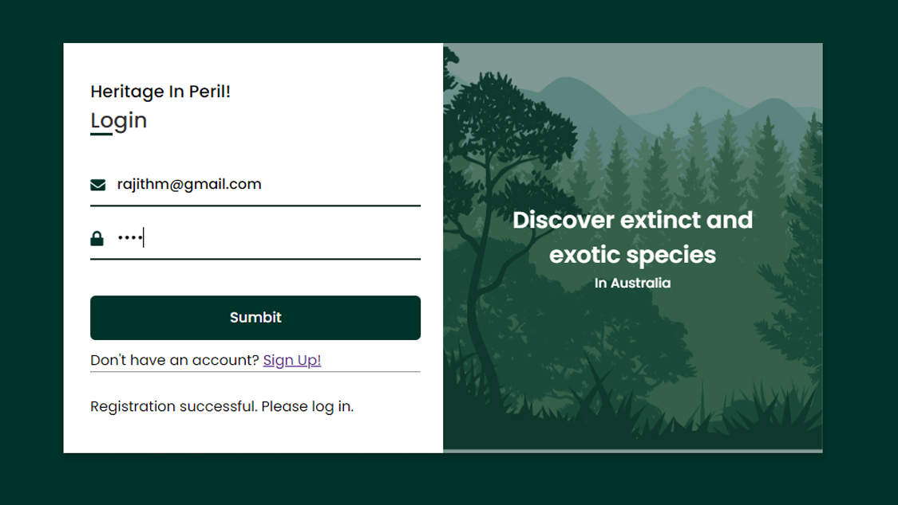
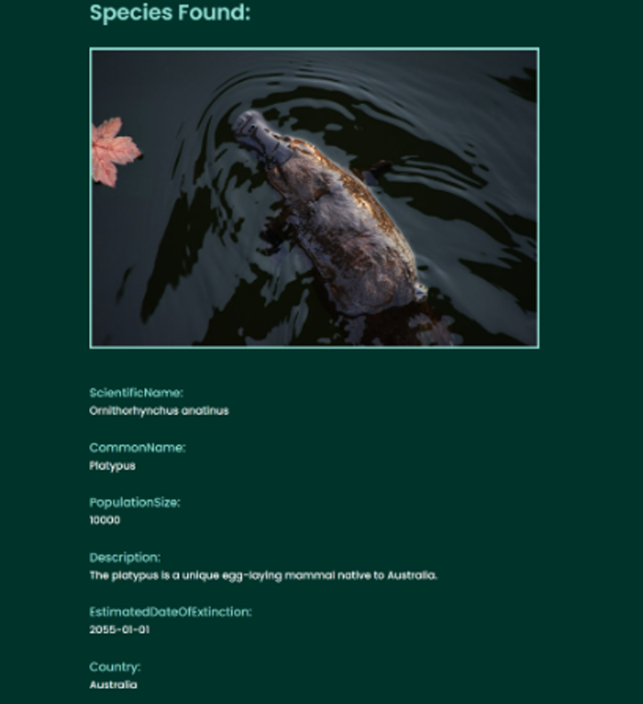

# Heritage In Peril

The Endangered Species Website is a comprehensive platform aimed at raising awareness about endangered species worldwide. The website employs a Database Management System (DBMS) powered by MySQL to efficiently manage and store critical information about endangered species, their habitats, and relevant analytics. The platform caters to two primary user roles: "Explorers" and "Collaborators."

An Explorer logs in and navigates the map page, selecting a specific region to view endangered species within that area. A Collaborator logs in and performs various operations such as adding a newly discovered species to the database, updating the conservation status of an endangered species, etc.

'
## Project Overview

This project is a web application built using Flask, a Python web framework. It includes a frontend with HTML, JavaScript, and jQuery, and a backend that interacts with a MySQL database.

## Languages and Libraries

### Backend
- **Python**: The primary language used for the backend.
- **Flask**: A lightweight WSGI web application framework.
  - `flask`: For creating the web application.
  - `flask_mysqldb`: For connecting to the MySQL database.
  - `requests`: For making HTTP requests.
  - `yaml`: For reading configuration files.

### Frontend
- **HTML**: For structuring the web pages.
- **JavaScript**: For adding interactivity to the web pages.
  - **jQuery**: A fast, small, and feature-rich JavaScript library.
  - **CSSMap**: A jQuery plugin for creating interactive maps.

### Database
- **MySQL**: A relational database management system.

## File Structure

- `app.py`: The main Flask application file.
- `templates/map.html`: HTML template for the map page.
- `static/includes/script.js`: JavaScript file for handling map interactions and other frontend logic.
- `db.yaml`: Configuration file for database connection settings.

## How to Run

1. **Install Dependencies**:
   ```sh
   pip install flask flask-mysqldb requests pyyaml
   ```

2. **Configure Database**:
   - Update the `db.yaml` file with your MySQL database credentials.

3. **Run the Application**:
   ```sh
   python app.py
   ```

## Routes

- `/`: Home page.
- `/login`: Login page.
- `/register`: Registration page.
- `/enter_species_details`: Page to enter species details.
- `/search_for_update`: Page to search for species to update.
- `/update_species_details`: Page to update species details.
- `/delete_species`: Page to delete species.
- `/map_page`: Page displaying the interactive map.
- `/analytics`: Analytics page.

# Login Page
'

# Display Species Page
'
## Additional Information

- The project uses a secret key for session management, defined in `app.py`.
- The `dummy_data.py` file is used to generate random dummy data for testing purposes.
- The `static/includes/script.js` file contains the logic for handling map interactions using the CSSMap plugin.

